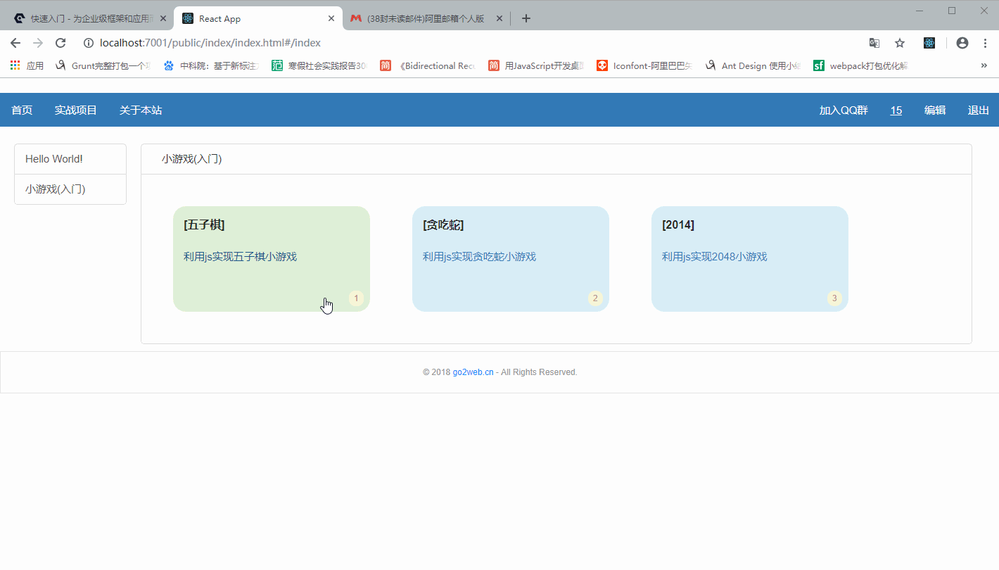
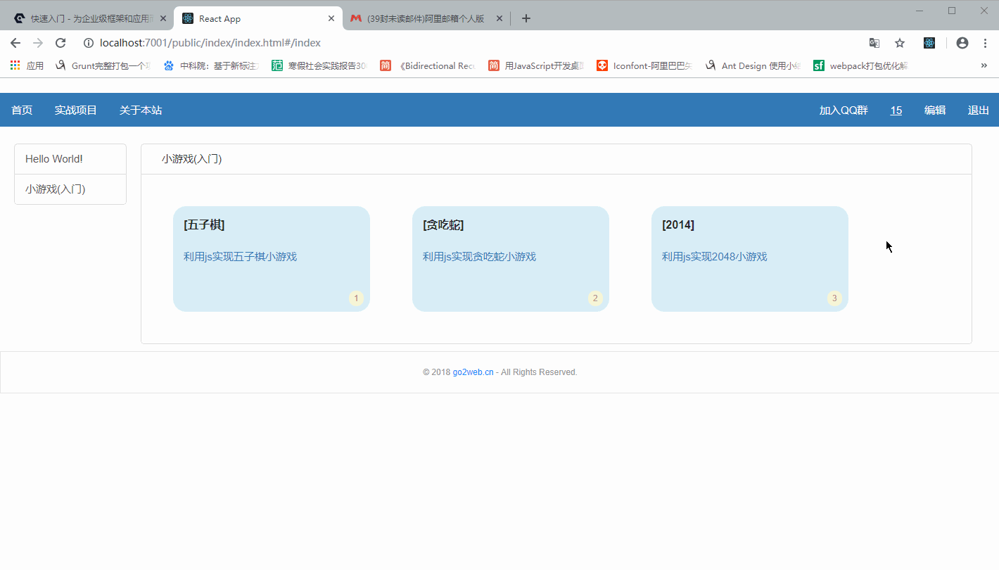
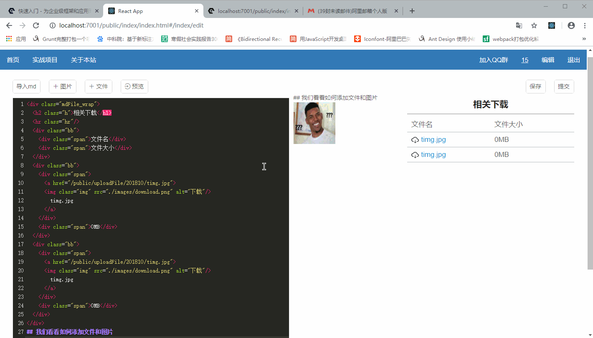

# simple-blog
这是一个简单的、未完成的个人博客，模仿how2j，算是我自学react、node的一次练手之作。

1. 前端使用react，后端使用eggjs。
2. 练手之作，功能并不完善。
3. 写完之后发现有很多的优化的地方，本项目不再更新，会另起一个项目重构。

## 主页
1. 查看编写的博客内容
2. 提供问答区域，可上传图片和编写代码。



## 编辑页
1. 使用md编辑内容
2. 方便的上传图片和文件，只需轻轻点击就可粘贴到md中，改善md不方便插入图片和文件的问题。



## 预览、保存、提交
1. 保存，能保存当前用户当前编辑器中的内容，下次登陆不会丢失。（存数据库啦）
2. 预览，将当前编辑器的内容预览，需要先保存。（因为从数据库读的啦）
3. 提交，保存md内容并发表出去



## 一个超级复杂的使用教程（sad）
1. clone项目，或者下载压缩包解压
```dos
git clone https://github.com/shiwusong/simple-blog
cd simple-blog
```
2. 新建一个新的数据库go2web，运行当前simple-blog文件夹中的go2web.sql

3. 执行一下一堆命令（当前文件夹在simple-blog中）
```dos
cd front/go2web
npm install
npm build
cd ../..
node copyBuild.js
cd server/go2web
npm install
npm run dev
```
4. 最后访问http://localhost:7001即可访问成功

如果出现没有编辑按钮的情况，请在数据库user表中把authority执为1.
目前添加目录功能没有实现，直接改数据库吧。反正个人使用并不影响。

## 651010646@qq.com 欢迎来信交流
